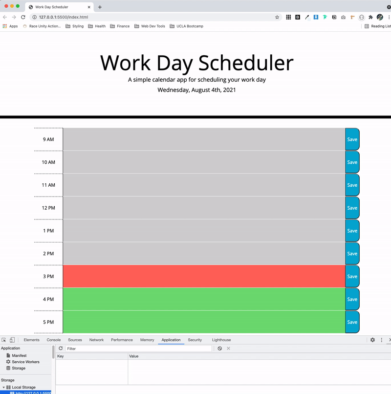

# Work Day Scheduler
## Description
The goal of this assignment was to modify starter code to create a simple calendar application that allows a user to save events for each hour of the day. The application uses local storage to save and display the activities added to the planner, and [Moment JS](https://momentjs.com/) to display the current date and time. 

## Technologies Used
* HTML
* CSS
* jQuery
* [Moment JS](https://momentjs.com/)


## User Story

```md
"As an employee with a busy schedule, I want to add important events to a daily planner so that I can manage my time effectively."
```

## Acceptance Criteria

```md
GIVEN I am using a daily planner to create a schedule
WHEN I open the planner
THEN the current day is displayed at the top of the calendar
WHEN I scroll down
THEN I am presented with timeblocks for standard business hours
WHEN I view the timeblocks for that day
THEN each timeblock is color coded to indicate whether it is in the past, present, or future
WHEN I click into a timeblock
THEN I can enter an event
WHEN I click the save button for that timeblock
THEN the text for that event is saved in local storage
WHEN I refresh the page
THEN the saved events persist
```

## Usage
[Here](https://go-yasi.github.io/work-day-scheduler/) is the link to the deployed application.  

Below is the GIF demonstrating the functionality of the application:  


